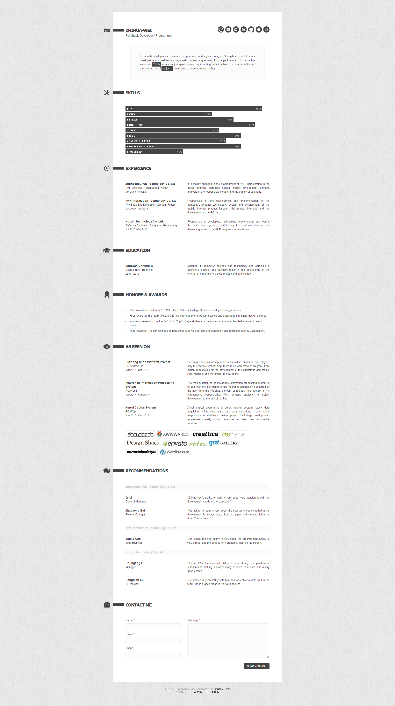
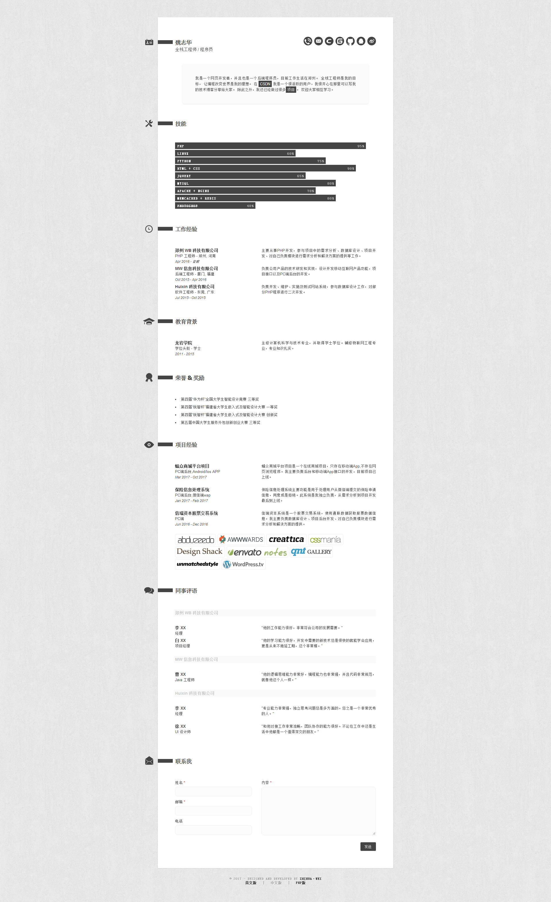

# 非你莫属_ZHIHUA.WEI个人简历主页

本项目用于参与码云举办的“非你莫属”为题的Pages简历模板/个性主页征集活动。本项目一共开发了PHP和HTML两种语言版本，前端工程师和后端工程师皆可使用。开源是一种精神！为中国的互联网行业发展献出一份小小的力量。

## 项目基本信息

- 此项目上的内容全是本人的真实信息，大家在使用时请不要直接复用
- 此项目设计风格布局来自于Christopher J. Molitor，非常感谢
- 个人简历项目可直接下载，修改内容后部署使用
- 项目在线演示地址：[http://resume.zhihuawei.xyz/](http://resume.zhihuawei.xyz/)
- Pages 服务地址：[http://zhihua_wei.gitee.io/zhihua.wei_resume](http://zhihua_wei.gitee.io/zhihua.wei_resume)
- 如果大家比较喜欢此项目，请大家先Star一下，然后进行Clone下载
- 此项目可同时支持PC端和移动端浏览，自适应布局，非常友好

## 项目下载

使用git从本人[zhihua_wei](https://gitee.com/zhihua_wei)主页下载项目

```bash
git clone https://gitee.com/zhihua_wei/ZHIHUA.WEI_resume.git
```

## 项目作者

也就是本人，大家可以直接从简历中了解，幸会幸会......
衷心祝愿各位小伙伴可以通过使用这份简历，都能找到满意的工作！！

## 项目展示

### 英文版-PC端



### 中文版-PC端



### 英文版-移动端
### 中文版-移动端
移动端就不展示了，图片太长，大家看着不舒服。如果大家很想看下效果图就访问一下我的在线演示地址就好了：[RESUME-ZHIHUA·WEI](http://resume.zhihuawei.xyz/)

或者大家把项目下载下来，查看assets文件夹下的MOBILE_RESUME-ZHIHUA·WEI_en.png和MOBILE_RESUME-ZHIHUA·WEI_ch.png图片文件。

